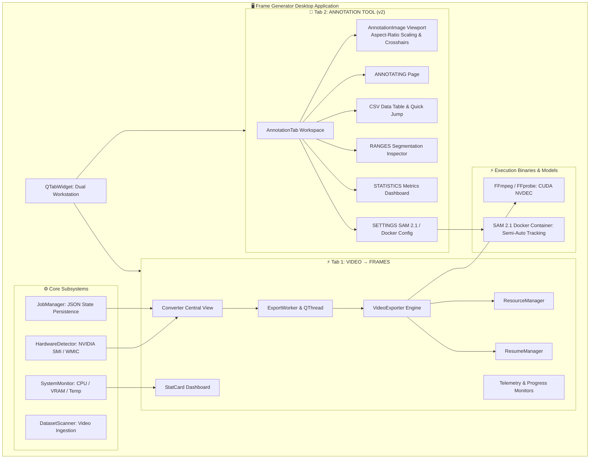

# 🎬 Frame Generator

<div align="center">

[](https://github.com/Ayan-Crafts/Frame-Converter/releases)
[](https://opensource.org/licenses/MIT)
[](https://www.python.org/)
[](https://pypi.org/project/PySide6/)
[](https://developer.nvidia.com/video-codec-sdk)
[](https://www.gyan.dev/ffmpeg/builds/)
[](https://www.microsoft.com/windows)

**High-Throughput GPU-Accelerated Video Frame Extraction & TrackNet Computer Vision Annotation Workstation.**

[Key Features](#-key-features) • [System Architecture](#-system-architecture) • [Annotation Suite](#-tracknet-annotation-suite-v2) • [Benchmarks](#-performance-benchmarks) • [Installation](#-installation--quick-start) • [Usage Guide](#-usage-guide) • [Releases](#-release-history) • [Author](#-developer--author)

</div>

---

## 📌 Overview

**Frame Generator** is an open-source, high-performance desktop workstation designed to solve the two biggest data bottlenecks in modern Computer Vision (CV) and Deep Learning pipelines: **high-throughput video frame extraction** and **high-precision sports ball tracking annotation (TrackNet)**.

When preparing massive video archives for object detection (YOLO, Faster R-CNN) or high-speed sports analytics (squash, tennis, badminton), conventional tools suffer from slow CPU decoding and cluttered annotation interfaces. Frame Generator bridges this gap by combining:
1. **GPU-Accelerated Frame Extraction (`VIDEO → FRAMES`)**: Raw NVIDIA CUDA (NVDEC) hardware decoding streaming frames at **over 1,770+ FPS (35.5x realtime speed)** with dynamic resource profiling and keyframe-accurate fault-tolerant resuming.
2. **TrackNet Computer Vision Annotation Suite (`ANNOTATION TOOL` - *New in v2*)**: A specialized, zero-occlusion image labeling workspace built for precision ball marking, motion blur categorization, automated SAM 2.1 model integration, interactive CSV management, range inspection, and live dataset telemetry.

---

## 🚀 What's New in v2 — "Alela Polema"

> 💡 *Looking for the initial release? **v1.0.0 — "On The Way To Burn"** is available under [GitHub Releases](https://github.com/Ayan-Crafts/Frame-Converter/releases).*

- 🎯 **Full-Featured TrackNet Annotation Tool**: Integrated dual-tab architecture embedding a dedicated annotation workstation directly into the main desktop interface.
- 🖼️ **Zero-Occlusion Frame Canvas (`AnnotationImage`)**: Image-first viewport that preserves source aspect ratios and places all controls below the frame so visual inspection is never obscured by menus or popovers.
- ⚡ **Severe Motion Blur Classification**: Added a dedicated labeling state for high-speed sports ball trails where motion blur elongates the ball, saving estimated center coordinates with explicit `SEVERE_MOTION_BLUR` status flags.
- 📑 **5-Tab Annotation Workflow**:
  - **`ANNOTATING`**: Responsive frame viewer, instant click-to-annotate crosshairs, fast frame jump navigation, play/pause preview, and auto-save.
  - **`CSV`**: Live interactive data table displaying the full TrackNet dataset with double-click frame jumping.
  - **`RANGES`**: Contiguous range summary for tracking rallies, occlusions, and out-of-bounds intervals.
  - **`STATISTICS`**: 13 real-time metric cards detailing annotation progress, visibility ratios, blur frequency, and manual vs. auto counts.
  - **`SETTINGS`**: AI model selector with Docker integration support for **SAM 2.1** (Tiny, Small, Base+, Large) and configurable confidence thresholds.
- 📐 **Adaptive Window Geometry**: Responsive UI scaling automatically adjusting to screen geometries for optimal viewing across laptops up to 27"+ monitors.
- 🗂️ **Clean Directory Organization**: Relocated test logs, specs, and benchmarks into `config tests/`.

---

## ✨ Key Features

### ⚡ Hardware-Accelerated Decoding (`VIDEO → FRAMES`)
- **NVIDIA NVDEC / CUDA Pipeline**: Zero-copy hardware video decoding via `ffmpeg -hwaccel cuda -hwaccel_output_format cuda` and `hwdownload,format=nv12` filter graphs.
- **Multi-Vendor GPU Support**: Automatic hardware detection for NVIDIA GPUs (querying VRAM, driver version, clock utilization via `nvidia-smi`) and AMD GPUs (via Windows WMIC), with graceful multi-threaded CPU fallback.
- **Lossless & High-Quality Modes**: High-precision frame dumps formatted as JPEG (`-q:v 2`) or PNG sequences with 6-digit zero-padded indexing (`%06d.jpg`).
- **Dynamic Resource Profiling (`ResourceManager`)**: Adapts FFmpeg thread counts and memory allocation dynamically based on available physical CPU cores and GPU VRAM.
- **Fault-Tolerant Resuming (`ResumeManager`)**: Scans destination directories for existing frames, detects interruption points, and performs keyframe-accurate seek (`-ss`) with frame discard filtering to resume without duplicate or dropped frames.
- **Persistent Job State (`JobManager`)**: Structured JSON job logging in `~/.frame-generator/jobs` supporting **Start**, **Pause**, **Resume**, **Stop & Keep**, and **Cancel & Clean**.

### 🎯 TrackNet Annotation Workstation (`ANNOTATION TOOL`)
- **Click-to-Annotate Crosshair**: Click directly on the ball center to assign `(x, y)` pixel coordinates mapped back to native frame resolution.
- **Comprehensive 5-State Visibility System**:
  - `● VISIBLE`: Ball is clearly visible (`visibility = 1`, `status = ACCEPTED`).
  - `◐ PARTIALLY OCCLUDED`: Ball is partially occluded (`visibility = 1`).
  - `✕ FULLY OCCLUDED`: Ball is hidden behind player/racket/wall (`x = 0, y = 0, visibility = 0`, `status = FULLY_OCCLUDED`).
  - `↗ OUT OF BOUNDS`: Ball has exited the frame (`x = 0, y = 0, visibility = 0`, `status = OUT_OF_BOUNDS`).
  - `≈ SEVERE MOTION BLUR`: Ball is stretched by extreme velocity; records clicked center coordinates (`visibility = 1`, `status = SEVERE_MOTION_BLUR`).
- **Fast Keyboard Navigation**:
  - `←` / `→`: Step backward / forward 1 frame
  - `Shift + ←` / `Shift + →`: Step backward / forward 10 frames
  - `Space`: Toggle real-time sequence playback
  - `Enter` (in frame box): Jump directly to a specific frame number
- **TrackNet CSV Compatibility**: Automatically writes and synchronizes standard `annotations.csv` files with core fields (`frame`, `x`, `y`, `visibility`) and audit fields (`x1`, `y1`, `x2`, `y2`, `source`, `confidence`, `status`).

---

## 🏗️ System Architecture



### Module Breakdown

| Directory / File | Description |
| :--- | :--- |
| [`app/main.py`](file:///s:/Thotta_Nee_Keta/Projects/Frame-Generator/app/main.py) | Application entry point; initializes `QApplication` and the main window. |
| [`app/ui/main_window.py`](file:///s:/Thotta_Nee_Keta/Projects/Frame-Generator/app/ui/main_window.py) | Main window coordinating the `VIDEO → FRAMES` converter and embedding `AnnotationTab`. |
| [`app/ui/annotation_tab.py`](file:///s:/Thotta_Nee_Keta/Projects/Frame-Generator/app/ui/annotation_tab.py) | **(New in v2)** Comprehensive TrackNet annotation suite with 5 sub-pages, canvas rendering, and CSV sync. |
| [`app/hardware/detector.py`](file:///s:/Thotta_Nee_Keta/Projects/Frame-Generator/app/hardware/detector.py) | Hardware probe querying NVIDIA CUDA devices, AMD GPUs, VRAM capacity, and driver versions. |
| [`app/processing/exporter.py`](file:///s:/Thotta_Nee_Keta/Projects/Frame-Generator/app/processing/exporter.py) | Core video exporter building and executing CUDA-accelerated FFmpeg subprocess pipelines. |
| [`app/processing/resource_manager.py`](file:///s:/Thotta_Nee_Keta/Projects/Frame-Generator/app/processing/resource_manager.py) | Dynamic resource allocator matching FFmpeg thread count to system VRAM & CPU cores. |
| [`app/processing/resume.py`](file:///s:/Thotta_Nee_Keta/Projects/Frame-Generator/app/processing/resume.py) | Directory inspector and keyframe offset calculator for seamless job resuming. |
| [`app/processing/worker.py`](file:///s:/Thotta_Nee_Keta/Projects/Frame-Generator/app/processing/worker.py) | Background `QThread` worker handling asynchronous batch exports without freezing the GUI. |
| [`app/processing/scanner.py`](file:///s:/Thotta_Nee_Keta/Projects/Frame-Generator/app/processing/scanner.py) | Dataset discovery module scanning input directories for supported video formats. |
| [`app/jobs/job_manager.py`](file:///s:/Thotta_Nee_Keta/Projects/Frame-Generator/app/jobs/job_manager.py) | Job state persistence engine writing structured JSON logs to `~/.frame-generator/jobs`. |
| [`app/monitoring/system.py`](file:///s:/Thotta_Nee_Keta/Projects/Frame-Generator/app/monitoring/system.py) | Telemetry collector measuring live CPU load, system RAM, GPU utilization, and VRAM. |
| [`app/utils/ffmpeg.py`](file:///s:/Thotta_Nee_Keta/Projects/Frame-Generator/app/utils/ffmpeg.py) | Cross-environment FFmpeg / FFprobe path resolver (supporting bundled and system PATH binaries). |
| [`config tests/`](file:///s:/Thotta_Nee_Keta/Projects/Frame-Generator/config%20tests) | Configuration files, PyInstaller spec, benchmark logs, and diagnostic test scripts. |

---

## 📊 Performance Benchmarks

Benchmark performed on an **NVIDIA GeForce RTX 4050 Laptop GPU (6GB VRAM)** and **FFmpeg 9.0.1 (Full Build with CUDA/NVDEC)**:

| Metric | Benchmark Result |
| :--- | :--- |
| **Input Source Video** | `squash 8 min.mp4` (1280x720 @ 50.0 FPS, H.264 / AAC) |
| **Total Video Duration** | 08:07.04 (487.04 seconds) |
| **Total Frames Extracted** | **24,352 frames** |
| **Total Processing Time** | **13.73 seconds** |
| **Average Extraction Speed** | **1,773.0 FPS** |
| **Speed Multiplier** | **35.5x realtime** |
| **GPU VRAM Utilization** | ~129 MiB / 6141 MiB (~2.1%) |
| **GPU Temperature** | 54.0°C (Stable under continuous load) |

> 📝 *Detailed benchmark logs and hardware acceleration verification outputs can be reviewed in [`config tests/ffmpegstats.txt`](file:///s:/Thotta_Nee_Keta/Projects/Frame-Generator/config%20tests/ffmpegstats.txt) and [`config tests/ffmpegtest.txt`](file:///s:/Thotta_Nee_Keta/Projects/Frame-Generator/config%20tests/ffmpegtest.txt).*

---

## 📦 Prerequisites

1. **Operating System**: Windows 10 / 11 (64-bit).
2. **GPU Driver**: NVIDIA GPU supporting CUDA with Driver Version 520+ (CUDA 11/12/13 compatible).
3. **FFmpeg Full Build**:
   - Download the full build with NVDEC/CUDA enabled from [Gyan.dev FFmpeg Builds](https://www.gyan.dev/ffmpeg/builds/) or [BtbN FFmpeg Builds](https://github.com/BtbN/FFmpeg-Builds/releases).
   - Ensure `ffmpeg.exe` and `ffprobe.exe` are either available on your system `PATH` or placed inside `packaging/ffmpeg/`.
4. **Python**: Python 3.9 to 3.14 (64-bit).

---

## 🚀 Installation & Quick Start

### Option A: Run Pre-Built Standalone Executable (Recommended)
If you pulled or downloaded the packaged release, run the standalone executable directly:
```powershell
.\dist\FrameGenerator\FrameGenerator.exe
```
*No Python setup or external dependency installation required.*

---

### Option B: Run from Python Source

#### 1. Clone the Repository
```bash
git clone https://github.com/Ayan-Crafts/Frame-Converter.git
cd Frame-Converter
```

#### 2. Create and Activate Virtual Environment
```powershell
# Using PowerShell on Windows
python -m venv .venv
.venv\Scripts\Activate.ps1
```

#### 3. Install Dependencies
```bash
pip install PySide6 psutil
```

#### 4. Launch Application
```bash
python app/main.py
```

---

## 💻 Usage Guide

### Workflow 1: Video to Frames Extraction (`VIDEO → FRAMES`)
1. Switch to the **VIDEO → FRAMES** tab.
2. Click **SELECT INPUT** to choose the folder containing your source videos (e.g., `Datasets/`).
3. Click **SELECT OUTPUT** to set the destination folder.
4. Click **START EXTRACTION**. The CUDA hardware engine will begin decoding.
5. Use **PAUSE**, **RESUME**, **STOP & KEEP**, or **CANCEL & CLEAN** to manage batch execution.

---

### Workflow 2: TrackNet Ball Annotation (`ANNOTATION TOOL`)
1. Switch to the **ANNOTATION TOOL** tab.
2. Click **SELECT FRAME DIRECTORY** and choose the folder of extracted frames. The tool automatically detects or creates `annotations.csv`.
3. In the **`ANNOTATING`** sub-tab:
   - Click the ball directly on the canvas with the mouse to mark its `(x, y)` location.
   - Select the appropriate state: `VISIBLE`, `PARTIALLY OCCLUDED`, `FULLY OCCLUDED`, `OUT OF BOUNDS`, or `SEVERE MOTION BLUR`.
   - Click **SAVE & NEXT ▶** (or enable **AUTO-SAVE**) to advance to the next frame.
4. Use the keyboard shortcuts (`←`/`→` for ±1 frame, `Shift+←`/`Shift+→` for ±10 frames, `Space` for playback) for rapid continuous annotation.
5. In the **`CSV`** sub-tab, review the full spreadsheet and double-click any row to jump directly to that frame.
6. In the **`STATISTICS`** sub-tab, monitor overall dataset completion, blur distribution, and class breakdown.

---

## 🗄️ Repository Structure

```
Frame-Generator/
├── app/
│   ├── database/               # Database and indexing interfaces
│   │   └── __init__.py
│   ├── hardware/               # Hardware detection & GPU probe
│   │   ├── __init__.py
│   │   └── detector.py         # NVIDIA SMI / AMD WMIC GPU detection
│   ├── jobs/                   # Job queue & persistence
│   │   ├── __init__.py
│   │   └── job_manager.py      # JSON state management in ~/.frame-generator/jobs
│   ├── monitoring/             # System telemetry & resource monitor
│   │   ├── __init__.py
│   │   └── system.py           # Real-time CPU, RAM, and GPU statistics
│   ├── processing/             # Video extraction & worker subsystem
│   │   ├── __init__.py
│   │   ├── exporter.py         # Subprocess FFmpeg pipeline builder
│   │   ├── resource_manager.py # Dynamic thread & VRAM profile allocator
│   │   ├── resume.py           # Frame offset inspector & resume logic
│   │   ├── scanner.py          # Dataset video discovery scanner
│   │   └── worker.py           # Multi-threaded QThread worker controller
│   ├── ui/                     # Graphical interface
│   │   ├── __init__.py
│   │   ├── annotation_tab.py   # (New in v2) Complete TrackNet annotation suite
│   │   ├── converter_tab.py    # Converter tab interfaces
│   │   └── main_window.py      # Dual-tab main window and stat card components
│   ├── utils/                  # Helper utilities
│   │   ├── __init__.py
│   │   └── ffmpeg.py           # FFmpeg & FFprobe binary path resolution
│   ├── __init__.py
│   └── main.py                 # Application launcher
├── config tests/               # Configuration, spec, and benchmark logs
│   ├── FrameGenerator.spec     # PyInstaller build specification file
│   ├── ffmpegstats.txt         # Reference FFmpeg version and hardware codec dump
│   ├── ffmpegtest.txt          # Sample benchmark run and GPU utilization log
│   ├── framexy.txt             # Quick mouse coordinate diagnostic script
│   ├── sources.txt             # External dataset and test video links
│   └── test.txt                # Diagnostic command reference
├── packaging/                  # Bundled distribution dependencies
│   └── ffmpeg/                 # Local FFmpeg/FFprobe binaries (gitignored)
├── .gitignore                  # Comprehensive exclusions for media, binaries & cache
├── LICENSE                     # MIT License
├── README.md                   # Project documentation
└── release.md                  # Release notes archive
```

---

## 🏷️ Release History

### [v2.0.0 — Alela Polema](https://github.com/Ayan-Crafts/Frame-Converter/releases) *(Current Release)*
- Integrated full **TrackNet Computer Vision Annotation Tool** (`AnnotationTab`) with dual-tab window management.
- Zero-occlusion aspect-ratio preserving frame canvas with native coordinate mapping.
- Added **Severe Motion Blur** classification for high-velocity ball tracking.
- Added **5-Page Annotation Workflow** (`ANNOTATING`, `CSV`, `RANGES`, `STATISTICS`, `SETTINGS`).
- Added semi-automatic AI tracking integration support with Docker (SAM 2.1).
- Added adaptive window geometry for responsive display across various screen sizes.

### [v1.0.0 — On The Way To Burn](https://github.com/Ayan-Crafts/Frame-Converter/releases/tag/v1.0.0) *(Initial Release)*
- CUDA NVDEC hardware-accelerated video-to-frames extraction engine (>1,770 FPS).
- PySide6 desktop GUI with real-time stat cards and hardware telemetry.
- Fault-tolerant resuming with keyframe backward seek and offset discard filters.
- Dynamic system resource and thread allocator (`ResourceManager`).
- Persistent JSON job state machine (`JobManager`).
- Standalone Windows PyInstaller packaging.

---

## 🛡️ Large File & Git Management

To adhere to GitHub's **100 MB per-file limit**, all heavy data assets are strictly excluded via [`.gitignore`](file:///s:/Thotta_Nee_Keta/Projects/Frame-Generator/.gitignore):
- **Video Assets**: `*.mp4`, `*.mkv`, `*.avi`, `*.mov`, `*.webm`, `*.flv`, etc.
- **Extracted Frame Sequences**: `*.jpg`, `*.png`, `*.webp`, `*.tiff`, `output/`, `Datasets/`, `benchmark_frames/`.
- **Binaries & Bundled Executables**: `packaging/ffmpeg/*.exe`, `*.dll`, `dist/`, `build/`.
- **Python Cache & Environments**: `__pycache__/`, `*.pyc`, `.venv/`, `venv/`.
- **Job Caches & Markers**: `.complete`, `.frame-generator/`, `*.log`.

---

## 🔨 Building Standalone Executable

Compile **Frame Generator** into a standalone Windows executable using PyInstaller:

```bash
# Install PyInstaller
pip install pyinstaller

# Build using the spec file located in config tests/
pyinstaller --clean "config tests/FrameGenerator.spec"
```

The compiled standalone application will be generated in `dist/FrameGenerator/FrameGenerator.exe`.

---

## 🗺️ Vision & Future Roadmap

- [x] High-speed CUDA (NVDEC) frame extraction engine.
- [x] PySide6 real-time monitoring and control dashboard.
- [x] Smart resume logic with keyframe seek and offset correction.
- [x] TrackNet Computer Vision Annotation Tool suite.
- [x] Severe Motion Blur ball classification.
- [ ] Direct annotation format exporters (YOLO `.txt`, COCO `.json`, Pascal VOC `.xml`).
- [ ] Multi-GPU parallel stream distribution for multi-video datasets.
- [ ] Embedded video preview player with visual timeline segment trimming.

---

## 🤝 Contributing

Contributions are welcome!
1. **Fork** the repository.
2. **Create a Feature Branch**: `git checkout -b feature/amazing-feature`
3. **Commit Your Changes**: `git commit -m "feat: Add amazing feature"`
4. **Push to the Branch**: `git push origin feature/amazing-feature`
5. **Open a Pull Request**.

---

## 📄 License

Distributed under the **MIT License**. See [`LICENSE`](file:///s:/Thotta_Nee_Keta/Projects/Frame-Generator/LICENSE) for full details.

---

## 👨‍💻 Developer & Author

<div align="center">

**Sanjay Kumar S**  
*Computer Vision & Deep Learning Engineer*

[](https://www.linkedin.com/in/sanjaykumarksk/)
[](https://github.com/Sanjay1712KSK)

</div>

