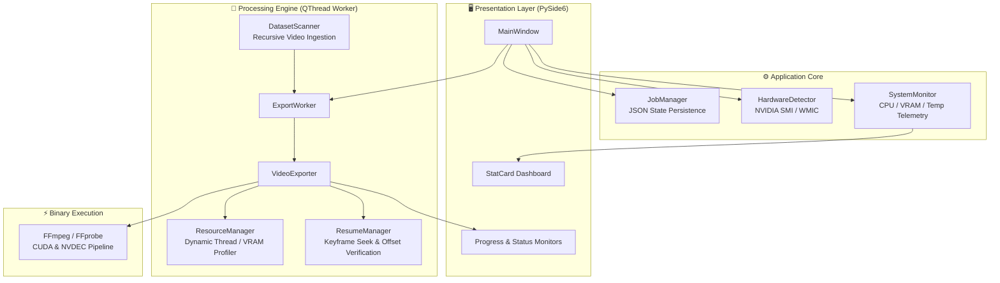

# 🎬 Frame Generator

<div align="center">

[](https://opensource.org/licenses/MIT)
[](https://www.python.org/)
[](https://pypi.org/project/PySide6/)
[](https://developer.nvidia.com/video-codec-sdk)
[](https://www.gyan.dev/ffmpeg/builds/)
[](https://www.microsoft.com/windows)

**High-Throughput, Hardware-Accelerated Video Frame Extraction & Computer Vision Dataset Curation Pipeline.**

[Key Features](#-key-features) • [System Architecture](#-system-architecture) • [Benchmarks](#-performance-benchmarks) • [Prerequisites](#-prerequisites) • [Installation](#-installation) • [Usage](#-usage-guide) • [Packaging](#-building-standalone-executable) • [Author](#-developer--author)

</div>

---

## 📌 Overview

**Frame Generator** is an open-source, high-performance desktop application and video processing engine designed to solve the data-ingestion bottleneck in modern Computer Vision (CV) and Deep Learning pipelines. 

When preparing massive video archives for object detection (YOLO, Faster R-CNN), video classification, or pose tracking, traditional CPU-bound frame extraction tools become severe bottlenecks. Frame Generator leverages native **NVIDIA CUDA (NVDEC)** hardware decoding and dynamic multi-threaded streaming to extract high-quality image sequences at **over 1,700+ FPS (35x+ realtime speed)**.

It pairs this raw extraction speed with a modern **PySide6 (Qt6)** graphical user interface, intelligent **fault-tolerant resuming**, dynamic **system resource profiling**, and persistent **job lifecycle management**.

---

## ✨ Key Features

### ⚡ Hardware-Accelerated Decoding
- **NVIDIA NVDEC / CUDA Pipeline**: Zero-copy hardware video decoding via `ffmpeg -hwaccel cuda -hwaccel_output_format cuda` and `hwdownload,format=nv12` filter graphs.
- **Multi-Vendor GPU Support**: Automatic hardware detection for NVIDIA GPUs (querying VRAM, driver version, clock utilization via `nvidia-smi`) and AMD GPUs (via Windows WMIC), with graceful multi-threaded CPU fallback.
- **Lossless & High-Quality Modes**: High-precision frame dumps formatted as JPEG (`-q:v 2`) or PNG sequences with 6-digit zero-padded indexing (`%06d.jpg`).

### 🖥️ Modern Desktop GUI (PySide6 / Qt6)
- **Live Performance Dashboard**: Real-time metric cards displaying extracted frame count, instantaneous FPS, processing speed multiplier, elapsed time, and ETA.
- **Hardware Telemetry**: Real-time monitoring of GPU load, VRAM consumption, GPU temperatures, host CPU usage, and system memory.
- **Interactive Controls**: Non-blocking asynchronous controls for **Start**, **Pause**, **Resume**, **Stop & Keep**, and **Cancel & Clean**.

### 🔄 Fault-Tolerant Resuming
- **Smart Directory Inspection**: Scans target folders to detect existing frame counts before kicking off jobs.
- **Keyframe-Accurate Seek**: Computes precise backward keyframe seek points (`-ss`) combined with frame-discard filters (`select='gte(n,X)'`) to eliminate duplicated or dropped frames upon resuming.
- **Completion Signatures**: Generates lightweight `.complete` tracking files to skip already-processed videos during batch runs instantly.

### 🧠 Dynamic Resource Management (`ResourceManager`)
- **System-Aware Profiling**: Dynamically calculates optimal FFmpeg worker threads and buffer allocations based on physical CPU cores and available GPU VRAM.
- **Thermal & Memory Safeguards**: Prevents system lockups by throttling buffer allocations when system resources run low.

### 🗂️ Persistent Job Queue (`JobManager`)
- **Structured Job History**: Maintains JSON-formatted job records under `~/.frame-generator/jobs` with unique UUIDs.
- **Lifecycle Tracking**: Full state tracking across `created`, `processing`, `paused`, `stopped`, `completed`, and `cancelled` states.

---

## 🏗️ System Architecture



### Module Breakdown

| Directory / File | Description |
| :--- | :--- |
| [`app/main.py`](file:///s:/Thotta_Nee_Keta/Projects/Frame-Generator/app/main.py) | Application entry point; initializes `QApplication` and the main window. |
| [`app/ui/main_window.py`](file:///s:/Thotta_Nee_Keta/Projects/Frame-Generator/app/ui/main_window.py) | Comprehensive PySide6 user interface, stat card layouts, styles, and signal connections. |
| [`app/hardware/detector.py`](file:///s:/Thotta_Nee_Keta/Projects/Frame-Generator/app/hardware/detector.py) | Hardware probe querying NVIDIA CUDA devices, AMD GPUs, VRAM capacity, and driver versions. |
| [`app/processing/exporter.py`](file:///s:/Thotta_Nee_Keta/Projects/Frame-Generator/app/processing/exporter.py) | Core video exporter building and executing CUDA-accelerated FFmpeg subprocess pipelines. |
| [`app/processing/resource_manager.py`](file:///s:/Thotta_Nee_Keta/Projects/Frame-Generator/app/processing/resource_manager.py) | Dynamic resource allocator matching FFmpeg thread count to system VRAM & CPU cores. |
| [`app/processing/resume.py`](file:///s:/Thotta_Nee_Keta/Projects/Frame-Generator/app/processing/resume.py) | Directory inspector and keyframe offset calculator for seamless job resuming. |
| [`app/processing/worker.py`](file:///s:/Thotta_Nee_Keta/Projects/Frame-Generator/app/processing/worker.py) | Background `QThread` worker handling asynchronous batch exports without freezing the GUI. |
| [`app/processing/scanner.py`](file:///s:/Thotta_Nee_Keta/Projects/Frame-Generator/app/processing/scanner.py) | Dataset discovery module scanning input directories for supported video formats. |
| [`app/jobs/job_manager.py`](file:///s:/Thotta_Nee_Keta/Projects/Frame-Generator/app/jobs/job_manager.py) | Job state persistence engine writing structured JSON logs to `~/.frame-generator/jobs`. |
| [`app/monitoring/system.py`](file:///s:/Thotta_Nee_Keta/Projects/Frame-Generator/app/monitoring/system.py) | Telemetry collector measuring live CPU load, system RAM, GPU utilization, and VRAM. |
| [`app/utils/ffmpeg.py`](file:///s:/Thotta_Nee_Keta/Projects/Frame-Generator/app/utils/ffmpeg.py) | Cross-environment FFmpeg / FFprobe path resolver (supporting bundled and system PATH binaries). |

---

## 📊 Performance Benchmarks

Benchmark performed on a host machine equipped with an **NVIDIA GeForce RTX 4050 Laptop GPU (6GB VRAM)** and **FFmpeg 9.0.1 (Full Build with CUDA/NVDEC support)**:

| Metric | Benchmark Result |
| :--- | :--- |
| **Input Source Video** | `squash 8 min.mp4` (1280x720 @ 50.0 FPS, H.264 / AAC) |
| **Total Video Duration** | 08:07.04 (487.04 seconds) |
| **Total Frames Extracted** | **24,352 frames** |
| **Total Processing Time** | **13.73 seconds** |
| **Average Extraction Speed** | **1,773.0 FPS** |
| **Speed Multiplier** | **35.5x realtime** |
| **GPU VRAM Utilization** | ~129 MiB / 6141 MiB (~2.1%) |
| **GPU Temperature** | 54°C (Stable under load) |

> 📝 *Detailed benchmark logs and hardware acceleration verification outputs can be reviewed in [`ffmpegstats.txt`](file:///s:/Thotta_Nee_Keta/Projects/Frame-Generator/ffmpegstats.txt) and [`ffmpegtest.txt`](file:///s:/Thotta_Nee_Keta/Projects/Frame-Generator/ffmpegtest.txt).*

---

## 📦 Prerequisites

Before running the application, ensure your environment meets the following requirements:

1. **Operating System**: Windows 10 / 11 (64-bit).
2. **GPU Driver**: NVIDIA GPU supporting CUDA with Driver Version 520+ (CUDA 11/12/13 compatible).
3. **FFmpeg Full Build**:
   - Download the full build with NVDEC/CUDA enabled from [Gyan.dev FFmpeg Builds](https://www.gyan.dev/ffmpeg/builds/) or [BtbN FFmpeg Builds](https://github.com/BtbN/FFmpeg-Builds/releases).
   - Ensure `ffmpeg.exe` and `ffprobe.exe` are either available on your system `PATH` or placed inside `packaging/ffmpeg/`.
4. **Python**: Python 3.9 to 3.14 (64-bit).

---

## 🚀 Installation

### 1. Clone the Repository
```bash
git clone https://github.com/Ayan-Crafts/Frame-Generator.git
cd Frame-Generator
```

### 2. Create and Activate a Virtual Environment
```bash
# Using PowerShell on Windows
python -m venv .venv
.venv\Scripts\Activate.ps1
```

### 3. Install Python Dependencies
```bash
pip install PySide6 psutil
```

### 4. Verify FFmpeg Hardware Acceleration
Run the following command in your terminal to verify that CUDA acceleration is recognized by your local FFmpeg installation:
```bash
ffmpeg -hide_banner -hwaccels
```
*Expected output should list `cuda`, `dxva2`, `d3d11va`, `vulkan`, `opencl`.*

---

## 💻 Usage Guide

### Running the Desktop GUI Application
Launch the PySide6 user interface by running:
```bash
python app/main.py
```
*Or via module syntax:*
```bash
python -m app.main
```

### Step-by-Step GUI Workflow
1. **Select Input Directory**: Click **Browse Input** and choose the folder containing your source videos (e.g., `Datasets/`). The dataset scanner will automatically index all video files and display total frame estimates.
2. **Select Output Directory**: Click **Browse Output** to designate the target root for extracted frame sequences. Each video will receive its own organized subfolder.
3. **Start Extraction**: Click **Start Extraction**. The dynamic resource manager initializes the CUDA pipeline.
4. **Monitor Progress**: Follow real-time frame rates, speed multipliers, percentage progress bars, and live GPU/CPU utilization.
5. **Control Options**:
   - **Pause**: Temporarily halts extraction while preserving process state.
   - **Resume**: Re-engages extraction seamlessly from the exact last extracted frame.
   - **Stop (Keep)**: Stops execution and retains all extracted frames to date.
   - **Cancel (Clean)**: Terminates FFmpeg and cleans up partial output files.

---

### Command-Line / Direct FFmpeg Usage

If you wish to execute a standalone extraction directly from PowerShell or Bash with identical CUDA acceleration parameters:

```bash
ffmpeg -hide_banner \
  -hwaccel cuda \
  -hwaccel_output_format cuda \
  -i "Datasets/your_video.mp4" \
  -map 0:v:0 \
  -vf "hwdownload,format=nv12" \
  -fps_mode passthrough \
  -q:v 2 \
  -threads 4 \
  -start_number 1 \
  "output/your_video/%06d.jpg"
```

To extract at a specific fixed frame rate (e.g., 1 frame per second for sparse sampling):
```bash
ffmpeg -hide_banner \
  -hwaccel cuda \
  -hwaccel_output_format cuda \
  -i "Datasets/your_video.mp4" \
  -vf "hwdownload,format=nv12,fps=1" \
  -q:v 2 \
  "output/your_video/frame_%04d.jpg"
```

---

## 🗄️ Repository Structure

```
Frame-Generator/
├── app/
│   ├── database/               # Database and indexing interfaces
│   │   └── __init__.py
│   ├── hardware/               # Hardware detection & GPU probe
│   │   ├── __init__.py
│   │   └── detector.py         # NVIDIA SMI / AMD WMIC GPU detection
│   ├── jobs/                   # Job queue & persistence
│   │   ├── __init__.py
│   │   └── job_manager.py      # JSON state management in ~/.frame-generator/jobs
│   ├── monitoring/             # System telemetry & resource monitor
│   │   ├── __init__.py
│   │   └── system.py           # Real-time CPU, RAM, and GPU statistics
│   ├── processing/             # Video extraction & worker subsystem
│   │   ├── __init__.py
│   │   ├── exporter.py         # Subprocess FFmpeg pipeline builder
│   │   ├── resource_manager.py # Dynamic thread & VRAM profile allocator
│   │   ├── resume.py           # Frame offset inspector & resume logic
│   │   ├── scanner.py          # Dataset video discovery scanner
│   │   └── worker.py           # Multi-threaded QThread worker controller
│   ├── ui/                     # Graphical interface
│   │   ├── __init__.py
│   │   └── main_window.py      # PySide6 main window & stat card components
│   ├── utils/                  # Helper utilities
│   │   ├── __init__.py
│   │   └── ffmpeg.py           # FFmpeg & FFprobe binary path resolution
│   ├── __init__.py
│   └── main.py                 # Application launcher
├── packaging/                  # Bundled distribution dependencies
│   └── ffmpeg/                 # Local FFmpeg/FFprobe binaries (gitignored)
├── FrameGenerator.spec         # PyInstaller build specification file
├── ffmpegstats.txt             # Reference FFmpeg version and hardware codec dump
├── ffmpegtest.txt              # Sample benchmark run and GPU utilization log
├── sources.txt                 # External dataset and test video links
├── test.txt                    # Diagnostic command reference
├── .gitignore                  # Comprehensive exclusions for media, binaries & cache
├── LICENSE                     # MIT License
└── README.md                   # Project documentation
```

---

## 🛡️ Large File & Git Management

To maintain repository speed and adhere to GitHub's strict **100 MB per-file limit** (and 50 MB warning threshold), all heavy data artifacts are strictly excluded via [`.gitignore`](file:///s:/Thotta_Nee_Keta/Projects/Frame-Generator/.gitignore):
- **Video Assets**: `*.mp4`, `*.mkv`, `*.avi`, `*.mov`, `*.webm`, `*.flv`, etc.
- **Extracted Frame Sequences**: `*.jpg`, `*.png`, `*.webp`, `*.tiff`, `output/`, `Datasets/`, `benchmark_frames/`.
- **Binaries & Bundled Executables**: `packaging/ffmpeg/*.exe`, `*.dll`, `dist/`, `build/`.
- **Python Cache & Environments**: `__pycache__/`, `*.pyc`, `.venv/`, `venv/`.
- **Job Caches & Markers**: `.complete`, `.frame-generator/`, `*.log`.

---

## 🔨 Building Standalone Executable

You can compile **Frame Generator** into a standalone Windows executable containing all bundled dependencies using **PyInstaller**:

```bash
# Install PyInstaller
pip install pyinstaller

# Build using the provided spec file
pyinstaller --clean FrameGenerator.spec
```

The compiled standalone application will be generated in `dist/FrameGenerator/FrameGenerator.exe`.

---

## 🗺️ Vision & Future Roadmap

- [x] High-speed CUDA (NVDEC) frame extraction engine.
- [x] PySide6 real-time monitoring and control dashboard.
- [x] Smart resume logic with keyframe seek and offset correction.
- [x] Persistent JSON job management.
- [ ] **AI-Powered Frame Filtering**: Automatic duplicate and blurry frame detection using Laplacian variance and perceptual hashing.
- [ ] **Direct Annotation Export**: Integration with YOLO (`labels.txt`), COCO (`annotations.json`), and Pascal VOC formats.
- [ ] **Multi-GPU Parallelization**: Distribute batch video queues across multiple CUDA devices.
- [ ] **In-App Video Previewer**: Embedded video player with interactive timeline frame trimming.

---

## 🤝 Contributing

Contributions are welcome! To contribute:
1. **Fork** the repository.
2. **Create a Feature Branch**: `git checkout -b feature/amazing-feature`
3. **Commit Your Changes**: `git commit -m "feat: Add amazing feature"`
4. **Push to the Branch**: `git push origin feature/amazing-feature`
5. **Open a Pull Request**.

Please ensure that no video datasets, image sequences, or binary executables are committed.

---

## 📄 License

Distributed under the **MIT License**. See [`LICENSE`](file:///s:/Thotta_Nee_Keta/Projects/Frame-Generator/LICENSE) for full details.

---

## 👨‍💻 Developer & Author

<div align="center">

**Sanjay Kumar S**  
*Computer Vision & Deep Learning Engineer*

[](https://www.linkedin.com/in/sanjaykumarksk/)
[](https://github.com/Sanjay1712KSK)

</div>
